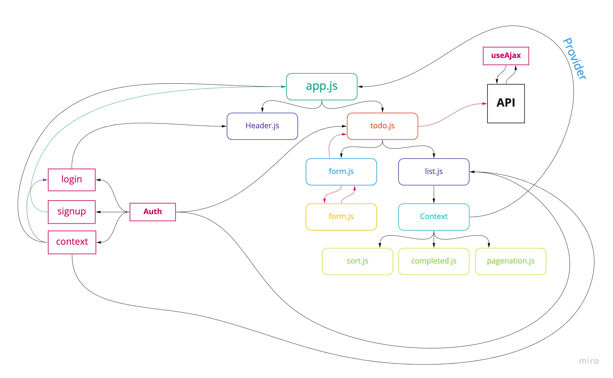

## Project: To Do

**Author:** _Waleed A. Afifi_

To Do List Manager Phase 4: Adding security and access controls to the application.

In this final phase, we’ll be requiring that users be logged in, in order to see the to do items. Additionally, based on their user type, they will be allowed (or denied) to perform actions such as editing or deleting them.


### Setup
```
git clone https://github.com/waleedafifi-401-advanced-javascript/todo.git
cd todo
npm i
```

#### How to initialize/run your application (where applicable)
```
npm start
```

#### How to use your library (where applicable)
Add new items to the to-do list to see them pop up on the left. Click on items to watch the count go up and down and to see the style of the list items change.

### Online test
Deployed URL: [Link]()

**Users list**
| **User** | **Password** | **Capabilities** |
| -------- | ------------ | -------------- |
| admin | ADMIN | (create, read, update, delete) |
| editor | EDITOR | (create, read, update) |
|user | USER | (read)|

#### UML



