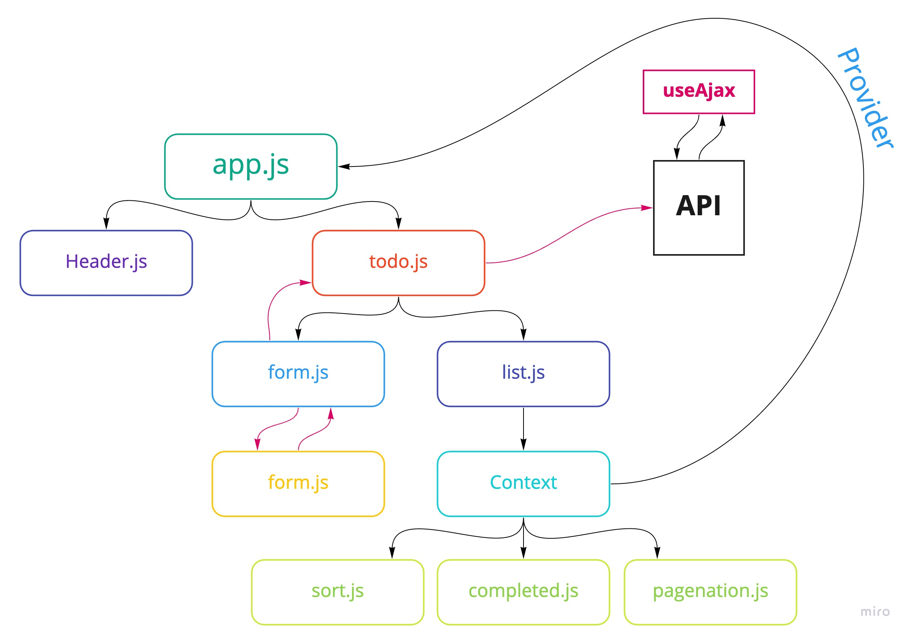

## Project: To Do

**Author:** _Waleed A. Afifi_

To Do List Manager Phase 3: Add some configuration settings to the application
In this phase, we’ll be adding some top-level settings for the application, so that the user can make some display choices that the app will use by default.

### Setup
```
git clone https://github.com/waleedafifi-401-advanced-javascript/todo.git
cd todo
npm i
```

#### How to initialize/run your application (where applicable)
```
npm start
```

#### How to use your library (where applicable)
Add new items to the to-do list to see them pop up on the left. Click on items to watch the count go up and down and to see the style of the list items change.

#### Tests

There is one test that shows that typing in a new list item and clicking submit will render it to the screen.
```
npm test
```

#### UML



